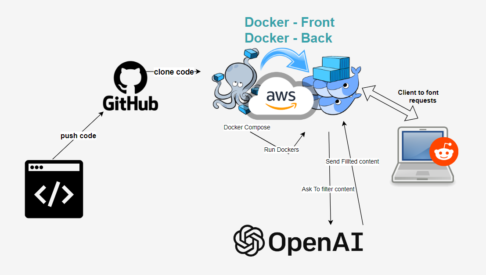
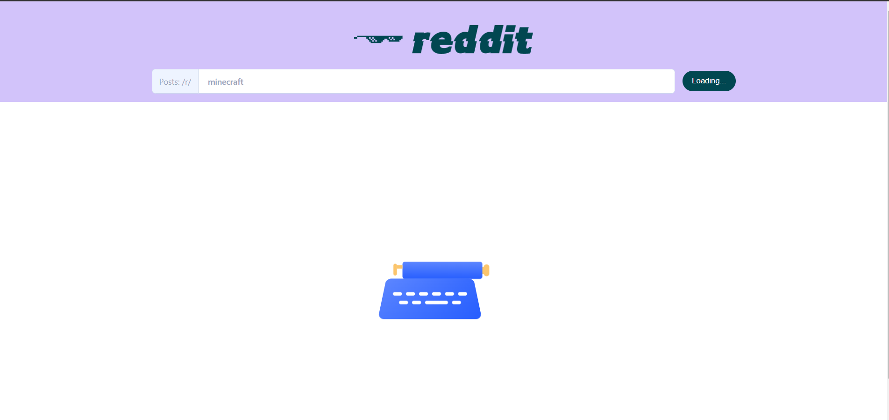
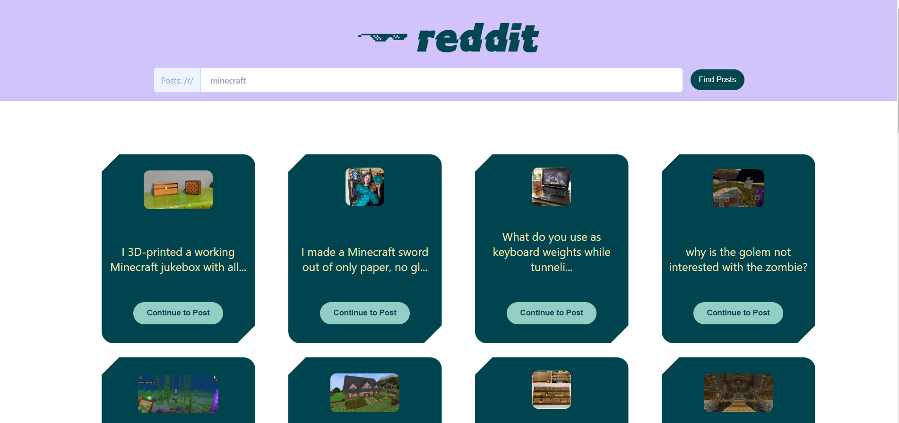
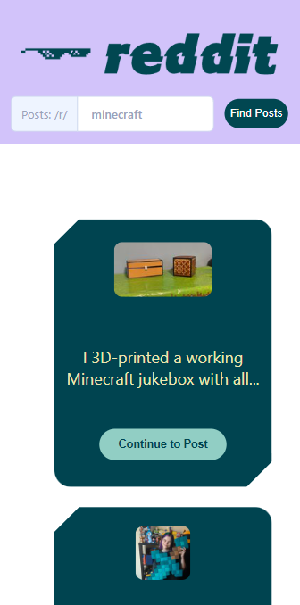
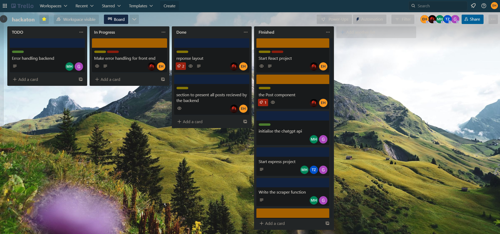

[](https://git.io/typing-svg)

<hr>

 

## We Were given a task from AppleSeeds to build an app that uses a scraper with the theme of coexistence:

-  The app should scrape data from another page.

-  The app should be promoting or helping the idea of coexisting.

-  Bonus to upload the app the AWS.


## Prerequisites - Frontend local
* Clone the repo
* Install / make sure you have node v16+ ->  [Download from the official website](https://nodejs.org/en )
* Have all the package.json dependencies install by using this command in the root directory of the project
```bash
> npm install
```


* Make sure you have a `running and operational` backend!
* Small cup of coffee 😉☕

## How To Use The App

- Press the search bar up on the navbar and click on it
- Insert whatever it is you want to search posts about
- Wait for the backend to get all data you need filtered and ready to go.
- Pick a post from one of the posts cards and enjoy! 😀

## App demo link 
[Reddit Positive Scraper Link](https://appleseeds-reddit-possitive-scrapper.netlify.app/)

<br>

# Screenshots:
 

 

<br>

# App responsiveness:

<br>

 


<br>
<br>

# Agile Methodology:
Trello is a project management tool that allows users to create and organize tasks in a visual manner. By creating small, manageable tasks and organizing them on Trello boards, the project team can have a clear overview of the project's progress and ensure that everyone is on the same page. Additionally, Trello helps to facilitate communication between team members and prevent large issues by allowing for easy identification and resolution of any potential concerns early on. By implementing a separation of concerns and utilizing Trello, our team was able to work efficiently and effectively towards the project's goals.

<br>

 

<br>

[](https://git.io/typing-svg)

In order to run the app locally you will need to install all the dependencies from the package.json file.  
Run the command ``` npm install ``` to install all the dependencies, after it's done you can run ``` npm start``` to start the app locally in ```localhost:3000```


<br>


# Summary
By going through all the steps and making sure you have the prerequisites you:
- Deployed the app locally with all the dependencies needed.
- Can make calls to the backend and handle the responses from it.
- Should be able to view filtered posts.

<br>

## `Group members`:

- Elad -           Fullstack
- Talal -          TL and Backend
- Artur -          Fullstack
- Mohamad Hassan - Backend
- Waleed -         Backend
